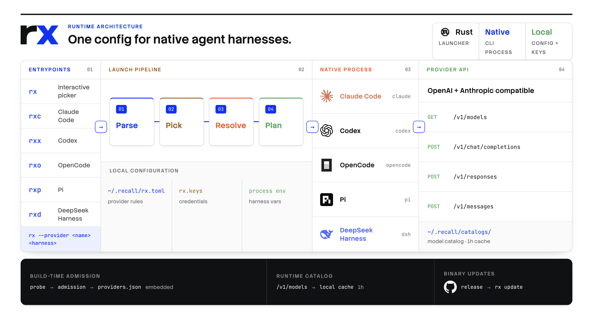

# rx

`rx` launches Claude Code, Codex, OpenCode, Pi, DeepSeek Harness, and Kimi Code with one provider configuration. It prepares each harness and runs its native CLI.

[](assets/rx-architecture.png)

## Install

```bash
git clone https://github.com/samzong/rx.git
cd rx
make install
```

## Usage

```bash
rx providers login
rx codex
rx --provider openrouter opencode
rx --provider none claude
rx dsh web
rx kimi
```

Running `rx` without a harness opens the picker; `tab` there picks a configured provider for that launch only, leaving the default unchanged. Arguments after the harness name are passed to that harness.
For Kimi Code, `rx` seeds the selected provider and its cached models as `rx-<provider>/<model>` aliases in Kimi's native catalog. `--model <id>` selects one of those models. Without it or a provider-level `model` in `rx.toml`, `rx` uses the first cached provider model and reports that choice on stderr. RX-owned entries are refreshed only while their payload remains unchanged; native and user-edited entries are preserved. Kimi requires catalog credentials in its config, so the selected provider key is also stored in Kimi's local `config.toml` with secret-only file permissions.

Concurrent `rx kimi` launches retain their catalog aliases until they exit. A later
launch reclaims unchanged entries no longer used by a running launch. Changing
an active alias to a different route fails; close the launch using that alias
before retrying. Identical catalog snapshots reuse a shared lease file; empty
lease files are retained as catalogs change, without automatic cleanup.

When upgrading from a version 1 Kimi catalog marker, first close all Kimi
sessions started by older rx versions. Run the same `rx kimi` command in a
terminal and type `migrate` when prompted to confirm those sessions have exited.
Declining the prompt or running without a terminal leaves the existing catalog
unchanged. Older rx versions cannot update the migrated catalog. Keep the
catalog marker and lease files in place, including when rolling back rx.

| Harness | Commands |
| --- | --- |
| Claude Code | `rx claude`, `rxc` |
| Codex | `rx codex`, `rxx` |
| OpenCode | `rx opencode`, `rxo` |
| Pi | `rx pi`, `rxp` |
| DeepSeek Harness | `rx dsh`, `rxd` |
| Kimi Code | `rx kimi`, `rxk` |

Provider commands:

```bash
rx providers list
rx providers use <provider>
rx providers models update [provider]
rx providers logout <provider>
```

Bundled provider metadata is compiled into the binary. Live model catalogs come from the selected provider and are cached under `~/.recall/catalogs/` for one hour. Custom provider configuration and admission requirements are documented in [PROVIDERS.md](docs/PROVIDERS.md).

## Development

Install Rust and cargo-audit 0.22.2, then run:

```bash
cargo install cargo-audit --locked --version 0.22.2
make check
make build
```

`make install` installs rx and its six shortcuts into the Cargo bin directory.
Shell completions are available through `rx completions bash|zsh|fish`.
The GitHub release workflow builds the four supported targets from the checked tag.

See [DESIGN.md](docs/DESIGN.md) for native behavior and ownership rules,
[PROVIDERS.md](docs/PROVIDERS.md) for provider admission, and
[HOSTING.md](docs/HOSTING.md) for the embedding protocol.
